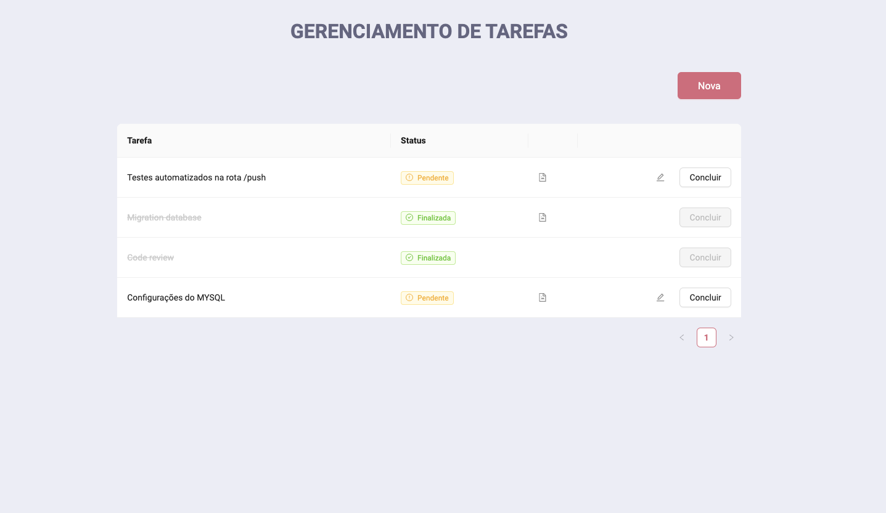

<h1 align='center'>
  Gerenciador de Tarefas
</h1>
<h2 align='center'> # Projeto desenvolvido com React </h2>

## 🏗 Running

```plainText
1° git clone https://github.com/andersonhcc/test-tasks

2° cd front

3° npm install (ou npm i)

4° mudar a URL da api em .env

5° yarn start

```

  